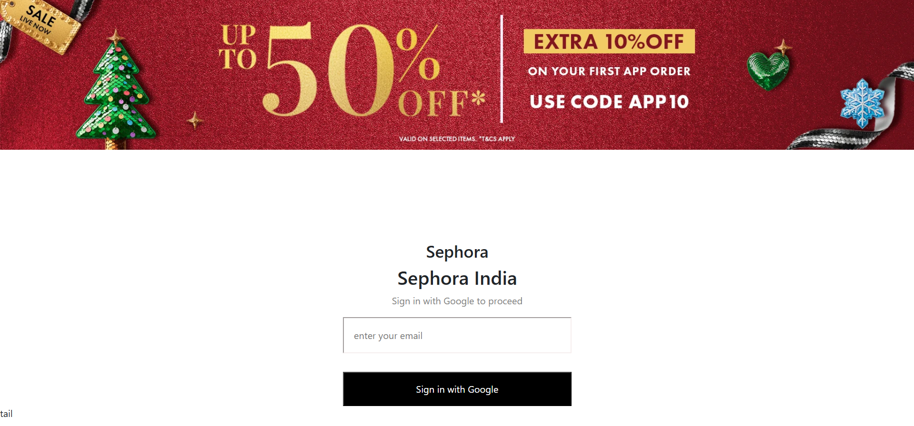
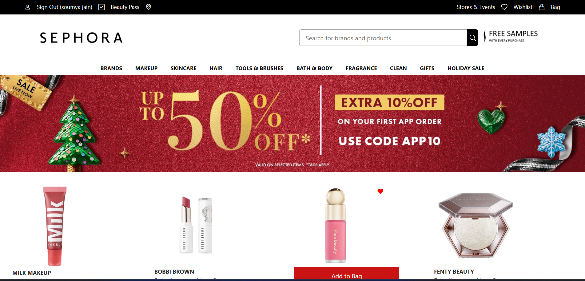
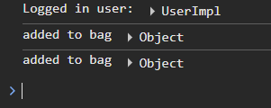

# 💄 Sephora Clone (Frontend)

A frontend clone of the Sephora website built using **React** to practice real-world UI development, component structuring, routing, and state handling.

This project focuses on **functionality + layout replication**, not just static design.

---

## 🔗 Live Demo


---


## 🛠 Tech Stack

- **React** (Functional Components & Hooks)
- **React Router DOM** – Page routing & protected routes
- **CSS** – Custom styling
- **Firebase Authentication** – Login & authentication
- **Git & GitHub** – Version control

---

## ✨ Features

- User Authentication (Login / Logout)
- Protected Routes
- Product Listing UI
- Add to Bag functionality
- Wishlist feature
- Responsive layout
- Component-based architecture

---

## 📁 Project Structure

src/
│── components/
│ ├── pages/
│ │ ├── Home.jsx
│ │ ├── Login.jsx
│ ├── Postcard.jsx
│── assets/
│── App.jsx
│── main.jsx
│── firebase.js
│── index.css

yaml
Copy code

---

## 🚀 Getting Started

### 1. Clone the repository
```bash
git clone https://github.com/soumya-987/sephora-clone.git
2. Install dependencies
bash
Copy code
npm install
3. Start the development server
bash
Copy code
npm run dev
🔐 Authentication
Firebase Authentication is used for user login.
Protected routes ensure only authenticated users can access the home page.

🎯 Learning Outcomes
Building a real-world React project

Managing state and props effectively

Implementing authentication

Handling routing and protected routes

Structuring scalable React applications

📌 Future Improvements
Backend integration

Product search & filters

Payment gateway

Admin panel

Better accessibility

👩‍💻 Author
Soumya Jain
Learning by building, not just watching tutorials.

## Screenshots



